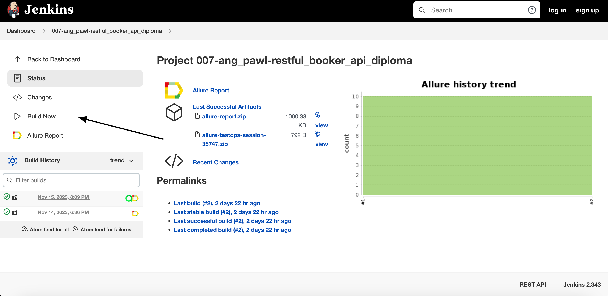
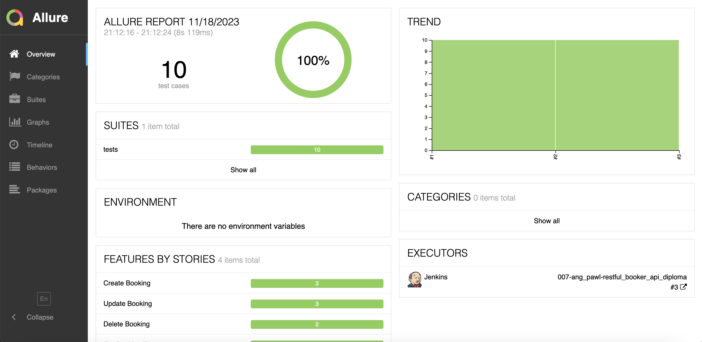
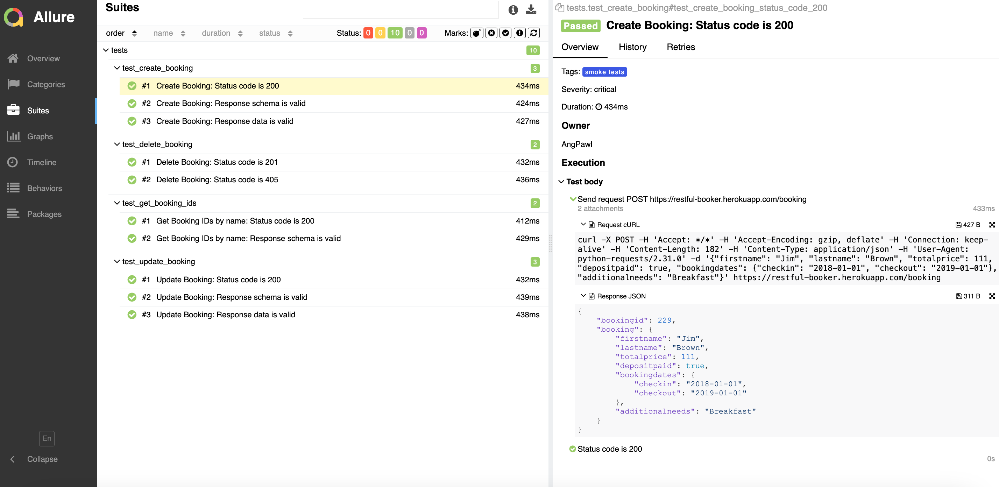
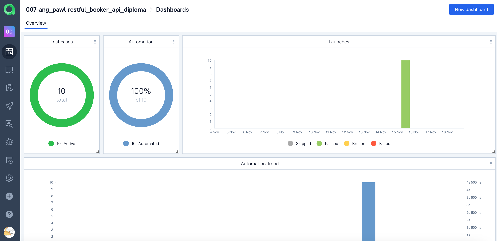
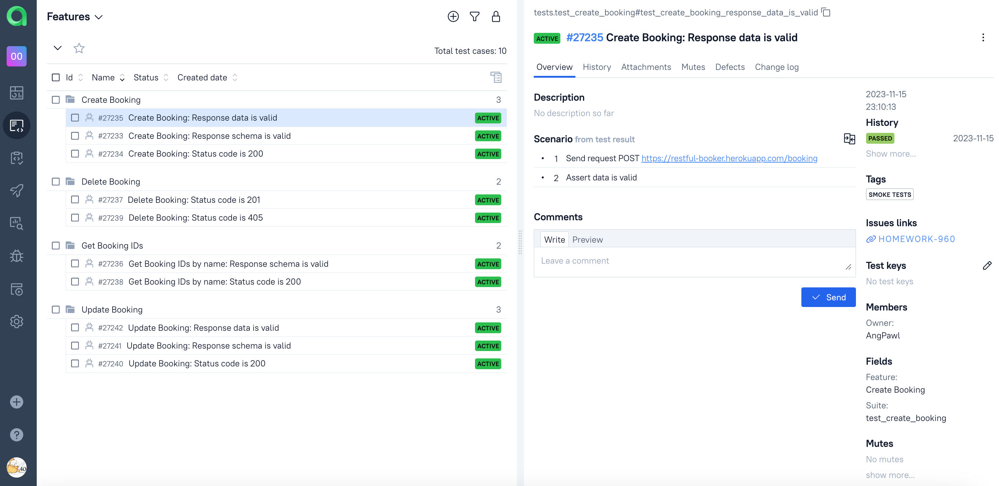
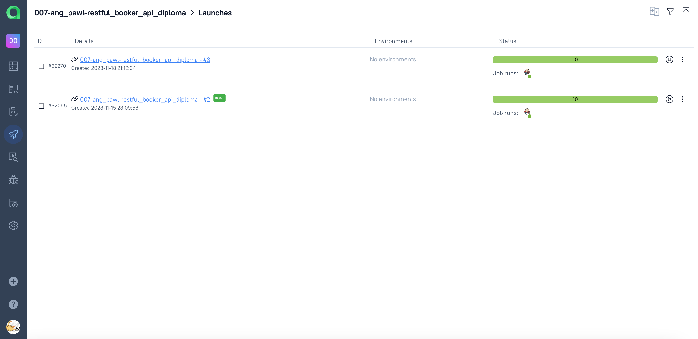
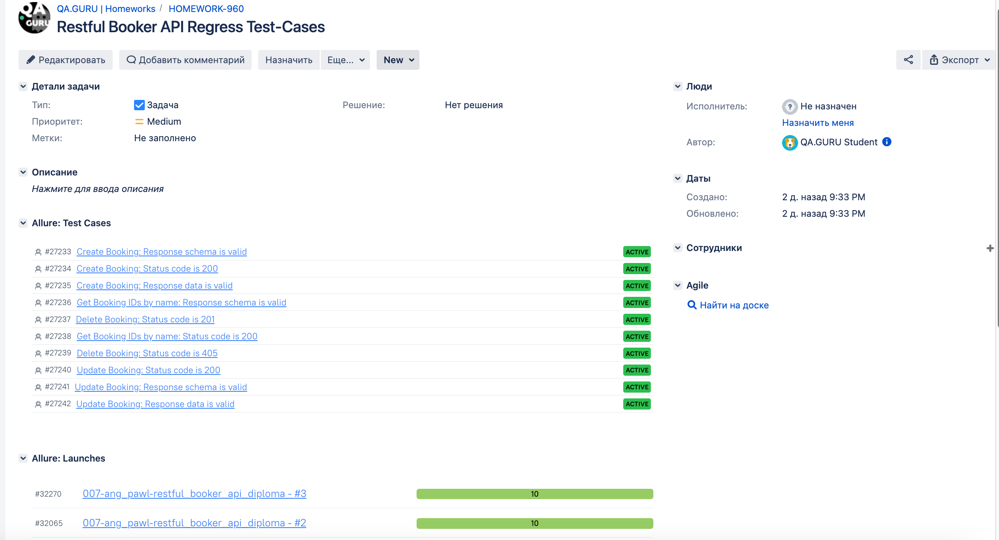
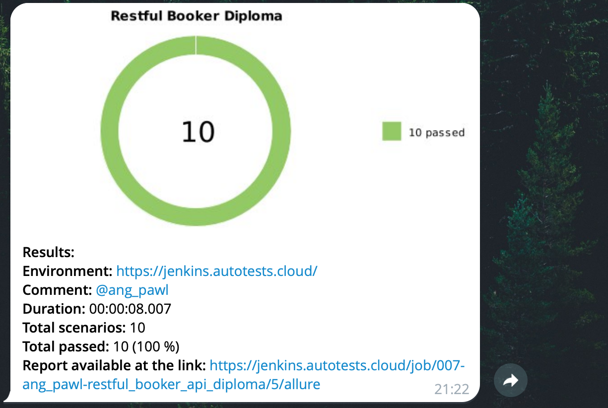

# Demo Project of API tests for <a target="_blank" href="https://restful-booker.herokuapp.com/">Restful Booker</a> service

### Tech Stack:
<code></code>
<code></code>
<code></code>
<code></code>
<code></code>
<code></code>
<code></code>
<code></code>

### Test cases:
- Create Booking:
  - Status code is 200
  - Response schema is valid
  - Response data is valid
- Delete Booking:
  - Status code is 201
  - Status code is 405
  - User cannot log in with invalid password
- Get Booking IDs:
  - Status code is 200)
  - Response schema is valid
- Update Booking:
  - Status code is 200
  - Response schema is valid
  - Response data is valid

### For local launch:

1. Create a new directory on your local machine

```bash
mkdir restful_booker_api_diploma
cd restful_booker_api_diploma
```

2. Clone the repository

```bash
git clone https://github.com/AngPawl/restful_booker_api_diploma
```

3. Create and fill in `.env` file based on env.example in the root project directory

4. Install and activate virtual environment

```bash
python -m venv .venv
```
  - For Linux/macOs:
  ```bash
  source .venv/bin/activate
  ```
  - For Windows:
  ```bash
  source venv/scripts/activate
  ```

5. Install dependencies from requirements.txt

```bash
pip install -r requirements.txt
```

6. Launch tests from command line

```bash
pytest .
```

## Remote run is executed via <a target="_blank" href="https://jenkins.autotests.cloud/job/007-ang_pawl-restful_booker_api_diploma/">Jenkins</a> job

### For remote launch:
- Open <a target="_blank" href="https://jenkins.autotests.cloud/job/007-ang_pawl-restful_booker_api_diploma/">Jenkins</a> job
- Click on Build Now



### *After the test run is completed you may check result info and related graphics on Allure Report page:*



### *You may also look through detailed result info for each test case:*



## General test run statistics are stored on <a target="_blank" href="https://allure.autotests.cloud/project/3791/dashboards">Allure TestOps</a> platform

### *Main Allure TestOps dashboard:*



### *Full list of automated test cases:*



### *Automated tests launch logs:*



## Test cases and run results are integrated with <a target="_blank" href="https://jira.autotests.cloud/browse/HOMEWORK-960">Atlassian Jira</a> and linked to the corresponding task



## Additionally, Telegram integration is set for immediate test result notifications:



## Проект мобильных автотестов на приложение Wikipedia

<!-- Описание -->

## :open_book: Описание
В проекте представлены примеры мобильной автоматизации тестирования на Python. 
<p>Реализован параметризированный запуск тестов на эмуляторе, реальном устройстве и ферме browserstack
<p>Подключена система отчетности Allure Reports с вложениями (логи, скриншоты, видео, etc). 
<p>В тестах шаги отображены в виде лямбда-степов через with allure.step
<p>Также по факту прохождения теста отправляется уведомление с результатами в Telegram.
<p>Реализована интеграция с Allure TestOps.

## :heavy_check_mark: Кратко
- [x] Кастомный локальный запуск с использованием `Android Studio` или `Browserstack`
- [x] Удаленный запуск с использованием `Jenkins` и `Browserstack`
- [x] `Allure Reports` с вложениями (логи, скриншоты, видео)
- [x] Интеграция с `Allure TestOps`
- [x] Отправка результатов тестирования в `Telegram`

<!-- Технологии -->

## :gear: Используемые технологии
<p  align="center">
  <code></code>
  <code></code>
  <code></code>
  <code></code>
  <code></code>
  <code></code>
  <code></code>
  <code></code>
  <code></code>
  <code></code>
  <code></code>
  <code></code>
<!--   <code></code> -->
  <code></code>
</p>


<!-- Тест кейсы -->

## :heavy_check_mark: Что проверяют тесты

- [x] Работу поиска
- [x] Сохранение результатов поиска
- [x] Заголовки onboardind screen
- [x] Добавление языка
- [x] Удаление языка 


<!-- Jenkins -->

##  Запуск тестов из [Jenkins](https://jenkins.autotests.cloud/job/003_t1me0ver_python_wikipedia_app/)

Для запуска тестов из Jenkins:
Нажмите кнопку "Собрать сейчас"

<p></p>

<!-- Browserstack -->

###  Запуск проекта в [Browserstack](https://app-automate.browserstack.com/dashboard/v2/builds/65244ceb48f2f2b65acc631d3c24a9359e0e63dc/sessions/4e836aedbcf9a24ccb8eecd0677bca5a6b5b00fb)
##### После запуска сборки в Jenkins, тесты начинают проходить удаленно через Browserstack. Где в реальном времени можно следить за прохождением теста через логи.

<p></p>

<!-- Локальный запуск -->

## :computer: Локальный запуск 

Для локального запуска:
1. Склонируйте репозиторий
2. Установите Poetry `poetry install`
3. Откройте проект в PyCharm, установите интерпретатор
4. Запустите BrowserStack
   - Получите ваш username, access key и загрузите apk из папки resources для получения app id
6. Установите Android Studio и Appium
   - Запустите Appim Server
   - Запустите в Android Studio эмуляцию устройства
   - Введите в командной строке `adb devices` для проверки, что устройство доступно
7. Создайте `env` файлы по образцам в папке проекта:
    - `config.browserstack.env` с вашими данными
9. Запустите тесты в PyCharm через командную строку: 
```bash
env -S "context=browserstack" pytest . --alluredir allure-results/
```
10. Проверьте статус запуска в BrowserStack

### :heavy_plus_sign: Параметры сборки

> - env -S "context=browserstack" - запуск через browserstack
> - env -S "context=real" запуск на реально подклченном устройстве
> - env -S "context=emulation" запуск через эмулятор

Обязательно создавать env файлы по образцу из проекта

<!-- Отчеты -->

## :bar_chart: Отчеты о прохождении тестов доступны в Allure

> При локальном запуске введите в командной строке: 
```bash
allure serve 
```

###  Allure

#### Примеры отображения тестов


###  Telegram

Настроена отправка отчета в Telegram


<!-- Allure TestOps -->

## :briefcase: Проект интегрирован с Allure TestOps 

#### Автоматически собраны тест-кейсы


#### Представлены дашборды аналитики

